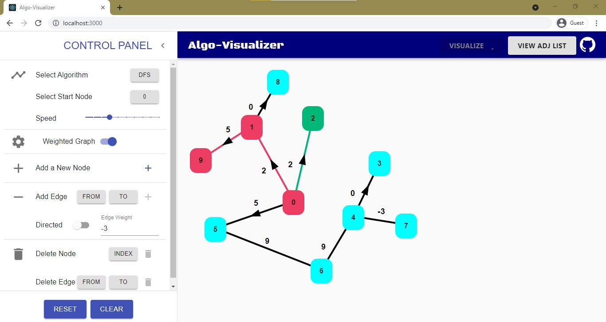
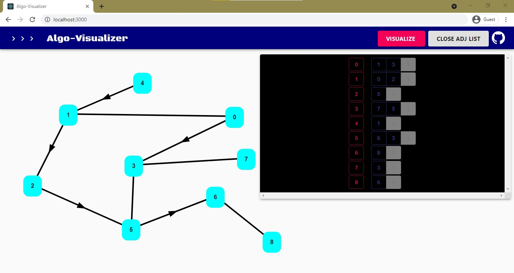

# Algo-Visualizer [[Visit]](https://algo-visualizer-f76e9.web.app/)

- An interactive tool to viusalize algorithms easily
- Built with React and MaterialUI

## Current Features

**[✔]** Add, move and delete nodes and edges

**[✔]** Directed/Undirected edges

**[✔]** Unweighted/Weighted edges

**[✔]** Visited nodes/edges animations

**[✔]** View Adjacancy List representation for a graph

**[✔]** Set visualization speed

## TODO

**[⛏]** Save Visualizations as videos

**[⛏]** Save graphs

**[⛏]** View visualization logs
